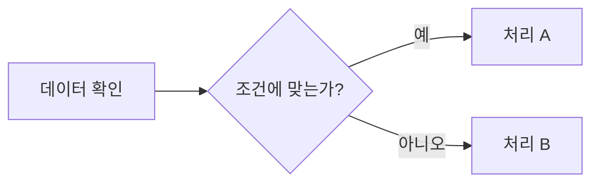
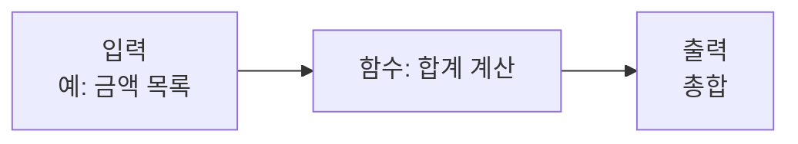
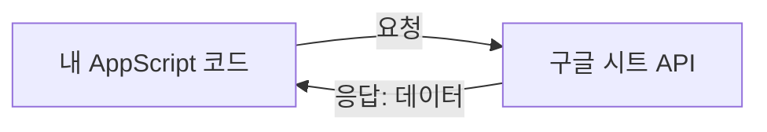
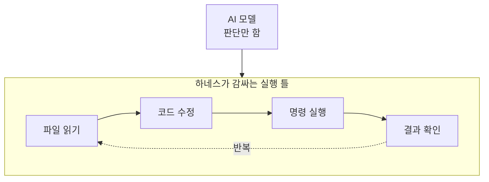

# 부록

> 오늘 다룬 개념을 더 깊이 이해하고 싶을 때 참고하세요.

## 쉘 · 런타임 · 프레임워크 · 라이브러리 · 패키지

| 구분 | 설명 |
|---|---|
| 쉘 (Shell) | PowerShell · 명령을 입력하는 대화창 |
| 런타임 (Runtime) | Node.js · 코드를 실제로 실행하는 엔진 |
| 패키지 매니저 | npm · 필요한 코드를 설치·관리 |
| 라이브러리 · 프레임워크 | 가져다 쓰는 기능과 전체 틀 |
| 나의 프로그램 | 우리가 작성한 코드 |


*쉘과 어플리케이션은 시스템 콜을 통해 커널에 요청하고, 커널이 하드웨어를 제어합니다.*


*사용자는 쉘과 어플리케이션 양쪽에 직접 명령을 내릴 수 있고, 쉘은 또 다른 어플리케이션을 실행시킬 수 있으며, 결국 모든 프로세스는 각자 독립적으로 커널과 통신합니다.*


*리눅스는 쉘이 시스템 콜을 통해 바로 커널에 요청하는 반면, 윈도우는 쉘과 NT 커널 사이에 Win32 API라는 추가 계층을 거칩니다.*

## 웹 · 애플리케이션 · DB 기본 구조


*사용자는 웹페이지를 보고 조작하고, 웹페이지는 어플리케이션(서버 프로그램)에 요청과 응답을 주고받으며, 어플리케이션은 데이터를 조회하거나 저장합니다.*

## 데이터와 변수

프로그램이 다루는 모든 값(숫자, 글자, 날짜 등)을 **데이터**라고 부르고, 그 값에 이름표를 붙여 담아두는 것이 **변수**입니다.

| 프로그래밍 개념 | 엑셀로 비유하면 |
|---|---|
| 데이터 (Data) | 셀 안에 들어있는 실제 값 |
| 변수 (Variable) | 셀 이름 (예: `예산합계`, `총인원`) |
| 값 변경 | 셀 내용을 다른 값으로 덮어쓰기 |

:::tip
AI에게 "예산합계 변수를 0으로 초기화해줘"처럼 **변수 이름을 정확히 지칭**하면, AI가 코드의 어느 부분을 고쳐야 할지 훨씬 정확하게 판단합니다.
:::

## 데이터 타입

같은 "값"이어도 종류에 따라 다루는 방식이 다릅니다. 이 종류를 **데이터 타입**이라고 합니다.

| 타입 | 예시 | 엑셀 서식으로 비유 |
|---|---|---|
| 문자열 (String) | `"예산팀"` | 텍스트 서식 |
| 숫자 (Number) | `12000` | 숫자 서식 |
| 불리언 (Boolean) | `true` / `false` | 체크박스(예/아니오) |
| 날짜 (Date) | `2026-07-13` | 날짜 서식 |

:::caution
"숫자처럼 보이는데 계산이 안 돼요"는 대부분 **숫자가 문자열로 저장된 경우**입니다. 엑셀에서 셀 서식이 "텍스트"로 되어 있으면 숫자 계산이 안 되는 것과 같은 원리입니다.
:::

## 데이터 구조: 배열과 객체

여러 데이터를 묶어서 다루는 두 가지 대표적인 방법입니다.

```
배열 (Array) = 목록          객체 (Object) = 항목의 묶음
["김한양", "이한양", "박한양"]   { 이름: "김한양", 부서: "예산팀" }
     ↕                              ↕
스프레드시트의 "행(row) 목록"      스프레드시트의 "한 행(row)"
```

| 구조 | 스프레드시트 비유 |
|---|---|
| 배열 | 여러 행이 쌓인 목록 전체 |
| 객체 | 한 행 안의 여러 열(항목) |

## 조건문과 반복문: 로직의 흐름

**조건문**(if)은 상황에 따라 다르게 동작하게 하고, **반복문**(loop)은 같은 작업을 여러 번 반복시킵니다.



| 개념 | 엑셀로 비유하면 |
|---|---|
| 조건문 (if) | `IF()` 함수 — 조건에 따라 다른 값 반환 |
| 반복문 (loop) | 자동채우기 — 같은 계산을 모든 행에 반복 적용 |

## 함수(Function): 재사용 가능한 작업 단위

입력을 받아 정해진 처리를 하고 결과를 내놓는, 이름 붙은 작업 덩어리입니다.



:::tip
`git diff`에서 함수 이름 한 줄만 바뀌어 있다면 "이 작업 단위 하나만" 수정된 것입니다. 함수 개념을 알면 diff의 변경 범위를 훨씬 빠르게 가늠할 수 있습니다.
:::

## API란? 서비스 간 대화 창구

**API**(Application Programming Interface)는 서로 다른 프로그램·서비스가 데이터를 주고받기 위한 정해진 "창구"입니다.



| 예시 | 설명 |
|---|---|
| 구글 시트 API | 시트의 값을 읽고 쓰는 창구 |
| 슬랙 API | 메시지를 자동으로 보내는 창구 |
| 날씨 API | 외부 날씨 정보를 받아오는 창구 |

## MCP란? AI가 외부 도구에 연결되는 표준

**MCP**(Model Context Protocol)는 AI 도구가 여러 외부 서비스(구글 드라이브, 슬랙, 데이터베이스 등)에 **일관된 방식**으로 연결하도록 만든 표준 규격입니다.

```
AI 도구  ──MCP──  구글 드라이브
        ──MCP──  슬랙
        ──MCP──  사내 데이터베이스
```

| 없다면 | 있다면 |
|---|---|
| 서비스마다 별도 연동 코드를 새로 작성 | 하나의 규격으로 여러 서비스에 동일하게 연결 |
| AI가 "각 서비스의 사용법"을 매번 새로 학습해야 함 | AI가 정해진 방식으로 도구 목록만 확인하면 됨 |

:::info
API가 "서비스 하나와의 대화 창구"라면, MCP는 "AI가 여러 창구를 표준화된 방법으로 찾아 쓰게 해주는 규칙"에 가깝습니다.
:::

## 에이전트 하네스(Harness)란?

**하네스**(Harness)는 AI 모델이 실제 작업을 끝까지 수행하도록 감싸는 "실행 틀"입니다. 오늘 설치한 **AI CLI 도구 자체가 하나의 하네스**입니다.



| 하네스가 하는 일 | 오늘 실습에서의 예 |
|---|---|
| 파일을 읽고 쓸 권한 관리 | 폴더 안의 `.gs` 파일 접근 |
| 실행 결과를 AI에게 다시 전달 | 명령 실행 후 결과를 보여주고 다음 판단에 반영 |
| 반복 작업의 흐름 제어 | "수정 → 확인 → 다음 단계" 반복 |

:::tip
AI 모델은 "머리", 하네스는 "손과 눈"에 가깝습니다. 같은 AI 모델이어도 어떤 하네스에 담겨 있느냐에 따라 할 수 있는 일의 범위가 달라집니다.
:::

## 오류와 예외처리

프로그램은 예상 밖의 상황(빈 값, 잘못된 형식 등)을 만나면 멈출 수 있습니다. **예외처리**는 이런 상황에 대비해 미리 "이럴 땐 이렇게 해라"를 정해두는 것입니다.

| 개념 | 설명 |
|---|---|
| 오류 (Error) | 프로그램이 예상치 못한 상황을 만나 멈춘 상태 |
| 예외처리 (try-catch) | 오류가 나도 프로그램 전체가 멈추지 않게 대비하는 코드 |

:::note
AI가 "오류 처리를 추가했습니다"라고 말하면, 대부분 "이 상황이 생겨도 프로그램이 죽지 않게 안전장치를 넣었다"는 뜻입니다.
:::

## 업무 자동화, 어디까지 가능할까요

| 영역 | 설명 |
|---|---|
| 데이터 정리 · 집계 | 여러 파일의 데이터를 모아 정리하고 계산 |
| 문서 · 보고서 자동화 | 정해진 양식에 맞춰 문서를 자동으로 생성 |
| 알림 · 커뮤니케이션 | 이메일, 메신저로 결과를 자동 전달 |
| 반복 실행 · 스케줄링 | 정해진 시간과 조건에 따라 자동으로 실행 |
| 시스템 · 서비스 연동 | 여러 서비스(API)를 연결해 데이터 송신 |
| AI 보조 자동화 | 문서 요약 · 분류 · 초안 작성 등에 AI를 활용 |

---

**처음으로:** [소개](/)
