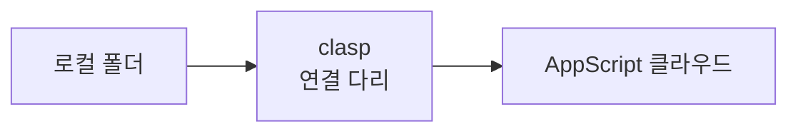
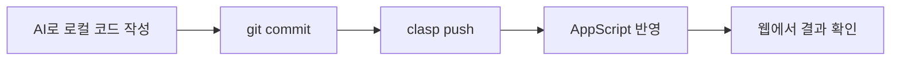

# Google AppScript 프로젝트 관리

> 오늘의 핵심, clasp로 연결하기

## AppScript 웹 에디터의 한계

- **제한적인 버전 기록** — 몇 단계 전으로만 되돌릴 수 있고, 세밀한 이력 관리가 어렵습니다
- **덮어쓰기 위험** — 여러 창에서 작업하면 실수로 서로 덮어쓰기 쉽습니다
- **AI CLI 도구와 분리** — AI CLI 도구는 로컬 파일을 다루는데, AppScript는 웹 안에만 존재합니다

## clasp = AppScript를 위한 다리

**clasp** (Command Line Apps Script Projects)는 로컬 폴더와 AppScript 클라우드를 연결하는 다리 역할을 합니다.



## 오늘 만들 파이프라인



## 실습 ⑦ clasp 설치 & Google 로그인

```powershell
npm install -g @google/clasp
clasp login
# 브라우저가 열리면 Google 계정으로 로그인 후 권한을 허용하세요
```

## 실습 ⑧ 예시 프로젝트 가져오기

오늘의 예시 프로젝트는 스프레드시트 데이터를 자동으로 정리해주는 간단한 AppScript 프로젝트입니다.

```powershell
clasp clone [스크립트 ID]

# > Cloned 2 files.
#   Code.gs
#   appsscript.json
```

## 실습 ⑨ 전체 흐름 한 번 돌려보기

```powershell
ai "Code.gs의 정리 함수에 날짜순 정렬 기능을 추가해줘"
# > Code.gs 를 수정했습니다.

git diff                     # 변경사항 검토
git add . && git commit -m "날짜순 정렬 기능 추가"
clasp push                   # AppScript에 반영

# 이제 AppScript 웹 에디터를 열어 결과를 확인해보세요
```

## 이런 상황, 조심하세요

:::caution
"협업 충돌"이 아니라, 혼자 작업해도 로컬과 AppScript 상태가 어긋나는 경우입니다.

예: push하지 않은 상태에서 웹 에디터를 직접 수정했거나, AI가 여러 번 고친 것을 되돌리고 싶을 때
:::

## 실습 ⑩ 케이스 A — 로컬 push 전에 웹에서도 수정한 경우

```powershell
clasp pull

# ! Warning: Your local changes would be overwritten.
# ! 로컬과 원격(AppScript)의 내용이 다릅니다.

# 당황하지 말고: git diff로 로컬 변경사항을 먼저 확인한 뒤
# 어느 쪽을 남길지 정하고 진행하세요
```

## 실습 ⑪ 케이스 B — AI가 여러 번 고친 걸 되돌리고 싶은 경우

```powershell
git diff                       # 무엇이 얼마나 바뀌었는지 확인
git stash                      # 지금 변경사항을 임시로 치워두기
git checkout -- Code.gs        # 마지막 커밋 상태로 되돌리기

# stash에 넣어둔 변경사항이 필요하면:
git stash pop
```

---

**다음:** [AI 도구 CLI 설치 & 실습](./ai-cli)
