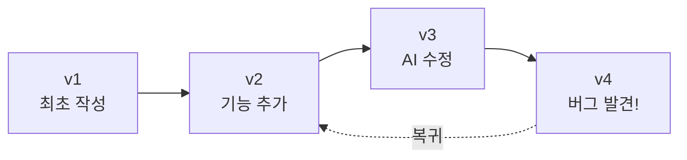

# Git 기초 개념 & 설치 & 실습

> 실습 환경 준비부터 코드의 타임머신까지

:::tip[프롬프트 표기 규칙]
오늘의 모든 실습은 **PowerShell**에서 진행합니다. 이 문서의 코드 블록에서 `$`로 표시된 프롬프트는 실제로는 `PS C:\Users\...>` 형태의 PowerShell 프롬프트를 간단히 표시한 것입니다.
:::

## 실습 환경 ① PowerShell 7.6.0 설치

Windows에 기본 내장된 "Windows PowerShell"과는 다른, 최신 버전인 PowerShell 7(pwsh)을 설치합니다.

```powershell
# winget으로 PowerShell 7.6.0 설치 (Windows 10/11 기본 포함된 winget 사용)
winget install --id Microsoft.PowerShell --source winget

# 설치 후 시작 메뉴에서 "PowerShell 7"(또는 pwsh)을 실행하세요
```

:::caution[기존 "Windows PowerShell"과 헷갈리지 마세요]
작업 표시줄/시작 메뉴에 파란색 아이콘(기존 PowerShell)과 검은색 아이콘(PowerShell 7)이 함께 보일 수 있습니다. 오늘은 반드시 "PowerShell 7"을 사용합니다.
:::

## 실습 환경 ② 설치 확인 & 기본 명령어

```powershell
PS C:\Users\you> $PSVersionTable.PSVersion

Major  Minor  Patch
-----  -----  -----
7      6      0
```

| 명령어 | 설명 |
|---|---|
| `pwd` | 지금 위치 확인 (`Get-Location`) |
| `ls` | 폴더 안 파일 목록 (`Get-ChildItem`) |
| `cd 폴더명` | 폴더 이동 (`Set-Location`) |

## 실습 환경 ③ Node.js 최신 LTS 설치

AI CLI 도구와 clasp 실행을 위해 꼭 필요합니다. LTS(Long Term Support)는 "가장 안정적인 장기 지원 버전"이라는 뜻입니다. 오늘은 이 버전을 사용합니다.

```powershell
winget install OpenJS.NodeJS.LTS
```

```powershell
# 설치 후 PowerShell 창을 새로 열고 버전을 확인하세요
node -v
# v22.14.0
npm -v
# 10.9.0
```

## Git = 코드의 "타임머신"

파일을 저장할 때마다 스냅샷을 남겨서, 언제든 그 시점으로 되돌아갈 수 있는 도구입니다.



## AI가 코드를 고칠수록, Git이 더 필요합니다

| Git 없이 | Git과 함께 |
|---|---|
| ❌ AI가 여러 파일을 동시에 수정 → 무엇이 바뀌었는지 알 수 없음 | ✅ 누가 언제 무엇을 바꿨는지 기록이 남음 |
| ❌ 문제가 생기면 처음부터 다시 작성 | ✅ 문제가 생기면 이전 커밋으로 즉시 복구 |
| ❌ "어제 버전"이 어디에도 남아있지 않음 | ✅ 실험적인 수정도 안심하고 시도 가능 |

## 핵심 개념 ① Commit — 작업의 스냅샷 찍기

의미 있는 작업 단위마다 "저장"하는 것입니다. 커밋 메시지로 무엇을 했는지 기록해두면, 나중에 이력을 한눈에 볼 수 있습니다.

```powershell
git add .
git commit -m "예산 계산 함수에 반올림 오류 수정"
# 좋은 커밋 메시지 = 나중의 내가 고마워하는 메시지
```

## 핵심 개념 ② Branch — 안전하게 실험하는 공간

원본(main)을 건드리지 않고 새로운 시도를 해볼 수 있는 "가지"입니다.

```
main   ●──────●──────●
        \
 branch  ●──────●──────●   (실험용 branch)
```

## 핵심 개념 ③ Diff & Revert — 무엇이 바뀌었나, 되돌리기

```powershell
git diff
# - const rate = 0.08;        # 삭제된 줄 (이전 코드)
# + const rate = 0.10;        # 추가된 줄 (변경된 코드)

git revert HEAD           # 방금 커밋을 되돌리기
git checkout -- file.js   # 특정 파일만 마지막 커밋 상태로
```

## 터미널을 편하게 쓰는 팁

| 단축키 | 설명 |
|---|---|
| `Tab` | 폴더/파일 이름을 끝까지 안 쳐도 자동완성 |
| `↑` / `↓` | 이전에 입력한 명령어를 다시 불러오기 |
| `Ctrl + C` | 실행 중인 작업을 강제로 멈추기 |

## 실습 ① Git 설치 확인

```powershell
git --version
# git version 2.43.0
```

:::note[설치가 안 되어 있다면]
[Git 설치 & 최초 설정](/env-setup/git-install) 문서를 참고해 설치를 먼저 진행해주세요.
:::

## 실습 ② git init → commit → log

```powershell
git init                        # 폴더를 Git 저장소로 만들기
# (파일 수정)
git add .                       # 변경사항을 커밋 대상으로 등록
git commit -m "첫 커밋"          # 스냅샷 저장
git log                         # 지금까지의 커밋 이력 확인
```

---

**다음:** [GitHub 개념 & 사용법](./github)
