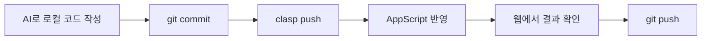

# 마무리 & 다음 단계

> 오늘 배운 것을 습관으로 만들기

## 앞으로 이 3가지만 기억하세요

1. **작업 시작 전** — `git status` / `pull` 확인하기
2. **AI 작업 후** — `diff`로 검토하고 나눠서 커밋하기
3. **.gitignore로** — 불필요한 파일 관리하기

:::danger 대외비 파일 주의
예산 자료, 개인정보가 담긴 시트 등 **대외비 파일은 절대 커밋하지 마세요.** 작업 폴더에 그런 파일이 있다면 반드시 `.gitignore`에 등록해 `git add`/`push` 대상에서 제외해야 합니다. 이미 커밋해버린 파일은 `.gitignore`에 나중에 추가해도 과거 이력에는 그대로 남으니, **커밋 전에 `git status`로 무엇이 올라가는지 항상 확인**하는 습관이 중요합니다.
:::

## 오늘의 전체 그림

이제 이 흐름을 직접 해보셨습니다.

🏁 **완주하셨습니다!**

## 다음 단계 (Coming Next)

여러 명이 함께 작업하는 협업 워크플로우를 다음 교육에서 다룹니다.

- Branch 전략 세우기
- Pull Request로 리뷰 주고받기
- 여러 명이 동시에 작업할 때의 merge conflict 해결

## 질문해주세요

오늘 다룬 명령어와 자료는 별도로 공유드립니다.

---

**다음:** [부록](./appendix)
